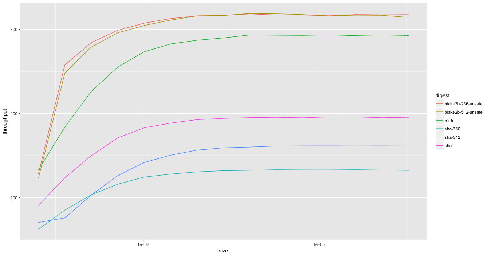

# About
Blake2b is a [high performance](performance.md) Java implementation of the **BLAKE2b** cryptographic hash function created by **Jean-Philippe Aumasson**, **Samuel Neves**, **Zooko Wilcox-O'Hearn**, and
**Christian Winnerlein**. (See [Blake2 project site](https://blake2.net) for details and authoritative information about the BLAKE2b digest.)

This implementation was made with close attention to the reference `C` implementation of **Samuel Neves** (<sneves@dei.uc.pt>). The quite excellent [`Go` implementation](github.com/dchest/blake2b) by **Dmitry Chestnykh** was also reviewed and referenced for optimization inspirations.

This library is provided in 2 pure Java variants (`master` and `unsafe` branches). See the [performance](performance.md) document for details.

## Fidelity
This implementation is provided with a suite of tests miminally covering the reference implementation `KAT` and `Keyed-KAT`, covering basic digest and MAC features (respectively). These may be inspected in the `src/test/` source fork of this repository.

Additionally, a `C` test program emitting a tree based hash was used to confirm the `Blake2b.Tree` output. Augmenting the `C` test program to test *salt*, and *personal* is on the TODO list. But do note that these 2 features have ***not*** been tested yet, though the confidence level for these is fairly maximal. (It is on the TODO list.)  

# License
Written by Joubin Mohammad Houshyar, 2014-2018

To the extent possible under law, the author has dedicated all copyright
and related and neighboring rights to this software to the public domain
worldwide. This software is distributed without any warranty.
http://creativecommons.org/publicdomain/zero/1.0/

# Features
`Blake2b` provides full support for the algorithm per the reference `C` implementation on the `JVM`, as adapted for `Java` semantics.  

The `API` very closely follows the `MessageDigest`'s relevant `public` methods e.g. `void update (byte[] input, int offset, int len)`, etc. 

As of now, fully configurable *Digest*, *MAC*, and *incremental hash (aka Tree)* are provided. 

(The parallel implementation of the algorithm is on the immediate TODO list.) 

# Installation and Use

## Installation 

First you need to clone this repo and install the product in your local `.m2` repository. (Getting this project to a central maven repository is on the TODO list.)

So, clone it in some happy place:

    git clone https://github.com/alphazero/blake2b

Go there:
    
    cd blake2b
    
And build and (locally) install it:

    mvn install

### Linking

To include `Blake2b` as a dependency in your `Maven` project, add the following to the `<dependencies>`section of your project `pom.xml`:

    <dependency>
        <groupId>ove</groupId>
        <artifactId>ove.blake2b</artifactId>
        <version>alpha.0</version>
    </dependency>

If you just want the `jar`, you can grab it from the project `target/` after `mvn install` or `mvn package`:

    <blake2b-dir>/target/ove.blake2b-alpha.0.jar

       
## API
The hashing `API` is defined by the top level `Blake2b` interface. This interface is implemented by the `Blake2b.Engine` and it is indirectly accessible via the semantic inner classes of `Blake2b`.  These methods allow for both *"streaming"* and basic hashing of `byte[]` input data.

The `API` mimics the relevant sub-set of the standard Java `MessageDigest` class and `Blake2b.Param` implements the (tag) interface `AlgorithmParameterSpec`, as preparatory support for possible `JCA` compliance. But that is not on my TODO list as of now. But care has been taken to make that path easy for you, should you wish to do so yourself. 

*** A note regarding input constraint checks ***

Typically one prefers a maximally defensive and pedantic implementation of functions that `assert` constraints on input arguments. But given that `Blake2b` is intended for high performance applications, the reference implementation (`Blake2b.Engine`) does not do so. So, pass in `null` and expect a `NullPointerException`, etc. ***Do note it.***

### `update`
`update(..)` is typically (*) used for sequential ("stream") updates of the digest.

The (3) variants of `update`:

* `void update (byte input)` to update with a single byte
* `void update (byte[] input)` to update with a `byte[]`
* `void update (byte[] input, int offset, int len)` to update with a slice of a `byte[]` 

Update methods treat all input args as immutable (`const` equivalent).

(*) Note that if your use case requires the (final) digest output of the algorithm to be copied to a slice of (user) supplied `byte[]`, even in the non-streaming case, you need to invoke an `update`.

### `digest`
Given that `final` is a keyword in Java and `finalize` has specific semantics in context of Java `Object`s, `digest(..)` is the Java equivalent of a hash `final(..)` method. 

The (3) variants of `digest`:

* `byte[] digest()` to emit the final hash of the `BLAKE2b` state.
* `byte[] digest(byte[] input)` to update the state with `input` and emit the final hash.
* `void digest(byte[] out, int off, int len)` writes the final hash to the given `byte[]`

**All `digest(..)` methods returning `byte[]` are guaranteed to return a non-`null` value.**

## Configuration and Usage
A `Blake2b` implementation can be used simply with default configuration parameters, or optionally, you may choose to set specific configuration parameters of the algorithm.

**Default Settings** (`Blake2b.Param.Default`)

    Digest Length:   64 bytes 
    Key:             none
    Salt:            none
    Personalization: none 
    Depth:           1
    Fanout:          1
    Leaf Length:     0
    Inner Length:    0
    Node Depth:      0
    Node Offset:     0

(***Note that all `Blake2b` semantic factory zero-arg methods use the above default configuration parameters.***)

    
### Configuration Via `Blake2b.Param`
You can change the default configuration via the `Blake2b.Param` class.

To obtain an instance of the Param class, simply instantiate it:

	// get an instance of the default configuration parameters
	
    Blake2b.Param param = new Blake2b.Param(); 
    
`Param` exposes a fluent setter `API` allowing for chaining of setXXx methods. 

For example:

	// get an instance of the default configuration parameters
	// and customize it with key, salt, and personalization,
	// and output a 160bit hash (say for SHA1 replacement)
	
    Blake2b.Param param = new Blake2b.Param().
       setDigestLength( 20 ). 
       setKey ( keyBytes ).
       setSalt ( saltBytes ).
       setPersonal ( personalizationBytes );
       
The constraints on the configuration parameter settings are detailed in `Blake2b.Spec`.

***Note that `Blake2b.Param` pedantically asserts all constraints on input args.***
    
### General Hashing with `BLake2b.Digest`

`Blake2b.Digest` instantiates the reference implementation of `Blake2b` isolating you from the current/actual implementation (`Blake2b.Engine`).

    // using default params
    final Blake2b blake2b = Blake2b.Digest.newInstance();        
or

    // using custom params
    final Blake2b blake2b = Blake2b.Digest.newInstance( param ); 

`Blake2b.Digest` also exposes a convenience factory method for the common case of a customized digest length:

    // Just config the output digest length - here 160bit output ala SHA1
    final Blake2b blake2b = Blake2b.Digest.newInstance( 20 );  

Note that you can use the `Blake2b` instance obtained via `Blake2b.Digest` factory methods to perform any of the features of the `BLAKE2b` algorithm with appropriate configuration via `Blake2b.Param`, should you prefer.

### Message Authentication Codes with `Blake2b.Mac`

**MAC** semantics are exposed by `Blake2b.Mac` class. This (convenience) class exposes a few factory methods.

    final Blake2b mac = Blake2b.Mac.newInstance ( theKeyBytes );      // basic MAC
and the common case of MAC with custom digest length

    final Blake2b mac = Blake2b.Mac.newInstance ( theKeyBytes, 20 );  // 160bit MAC
   
You can also use a `java.security.Key` (which ***must*** support `encoding` -- see Key javadocs for details) instead of a raw `byte[]` array:
    
    import java.security.key; 
    ..
    
    final Key thekey = .. // not provided by Blake2b library
    
    // 160bit MAC with Key
    final Blake2b mac = Blake2b.Mac.newInstance ( theKey, 20 );  

### Incremental Hashing with `Blake2b.Tree`	
The `Blake2b.Tree` class provides a convenient semantic `API` for incremental hasing with `Blake2b`.

    // incremntally hash a stream of bytes using Blake2b.
    // here a tree of depth 2, fanout 3, leaf length of 4096, inner length of 64,
    // and a final (tree) hash output of length 20)
    
    Blake2b.Tree tree = Blake2b.Tree (2, 3, 4096, 64, 20);
    
    // assume that we got our 3 chunks obtained elsewhere
    // and these are byte[] of max "leaf length" bytes (here 4096).
    // Also note that nodes will output a hash of length "inner length"

    // hash the chunks
    
    byte[] hash_00 = tree.getNode (0, 0).digest ( chunk00 ); 
    byte[] hash_01 = tree.getNode (0, 1).digest ( chunk01 );
    byte[] hash_02 = tree.getNode (0, 2).digest ( chunk02 ); // implicit 'last node'
    
    // get the final tree hash output
    
    final Blake2b digest = tree.getRoot(); // implicit node (1, 0)
    digest.update (hash_00);
    digest.update (hash_01);
    digest.update (hash_02);
    final byte[] hash = digest.digest();

# Dedication
    To the Eternal Absolute, The One, ~!!! Ahura-Mazda !!!~ *even* ~!!! Al-Aziz-Al-Hakim !!!~, 
    The Lord of Sentient Realms, The True in Love. 
    The Friend.

--

Feb. 2014. 
bushwick. bk. nyc.
