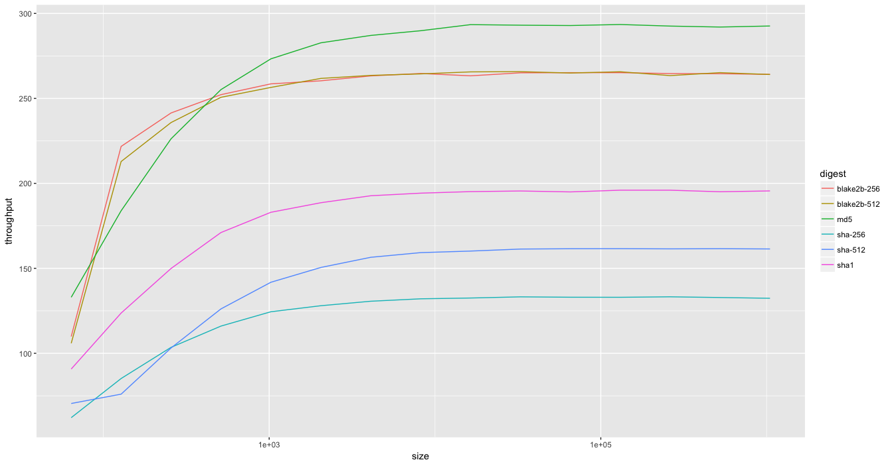

# Performance

The standard pure Java version (`master` branch) is highly optimizied but the conversion of user data block  with `little-endian` semantics to the `long[]` 
`m` registers of the algorithm in `compress()` is a performance bottleneck. That said the `master` branch version performs 
substantially better than other pure Java libraries.

The `unsafe` version (`unsafe` branch) addresses this bottleneck and achieves ~ `4.1 byte/cycle` on a fairly dated `i5 1.3 MHz` 
MacBook Air. (This compares rather favorably with the `3.08 bytes/cycle` noted on the official [Blake2b](https://blake2.net/) 
site. To close that gap would likely require use of `SIMD` operations which can not (afaik) be done in pure Java. (`unsafe` is 
only used to efficiently convert the compress'd block `byte[]` to `long[]`. No non-JVM-managed memory operations are performed, so 
this should be your choice if you are OK with use of the use `unsafe` package.)

## Bench

This library includes a benchmark utility which you can run using the provided `jars` in `lib/` (or directly in the `master` or 
`unsafe` branch).

    java -cp <your choice of the 2 jars> ove.crypto.digest.Bench -d <digest-name>
    
### Results

The [comparative results](benchmarks/results.txt) (per machine spec above) are `Bench` runs for both variants of this library's `Blake2b`, `MD5`, `sha1`, 
`sha-256`, `sha-512`, and `Bounch Castle` version of the Blake2b algorithm. 

#### Blake2b (master branch)

#### Blake2b (unsafe branch)

#### Comparative vs Bouncy Castle

